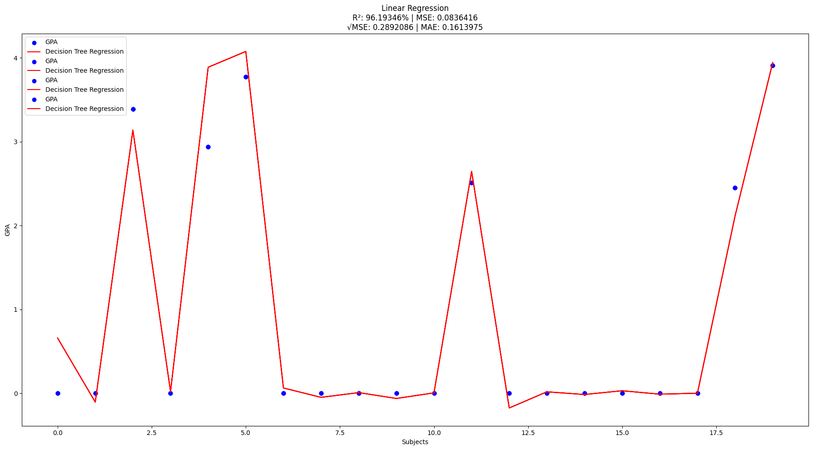
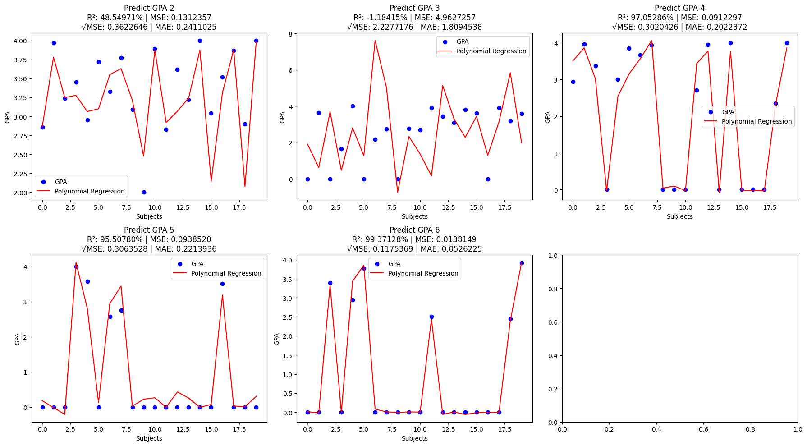
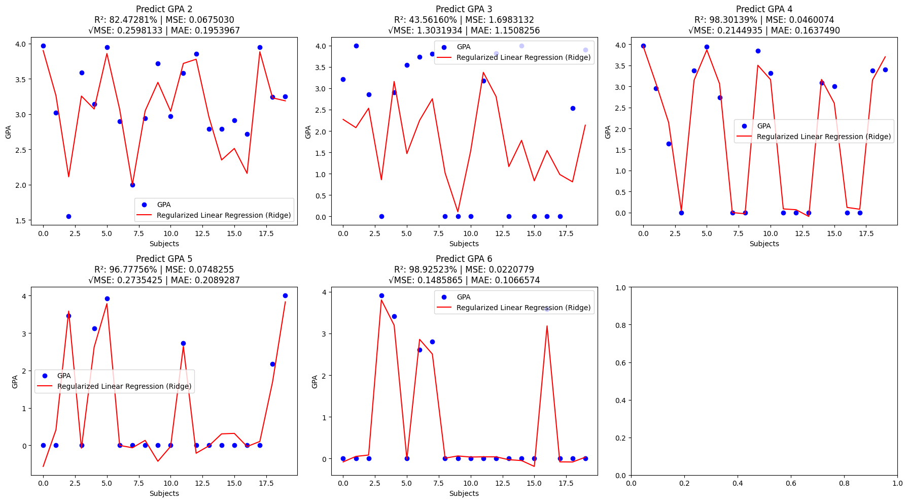
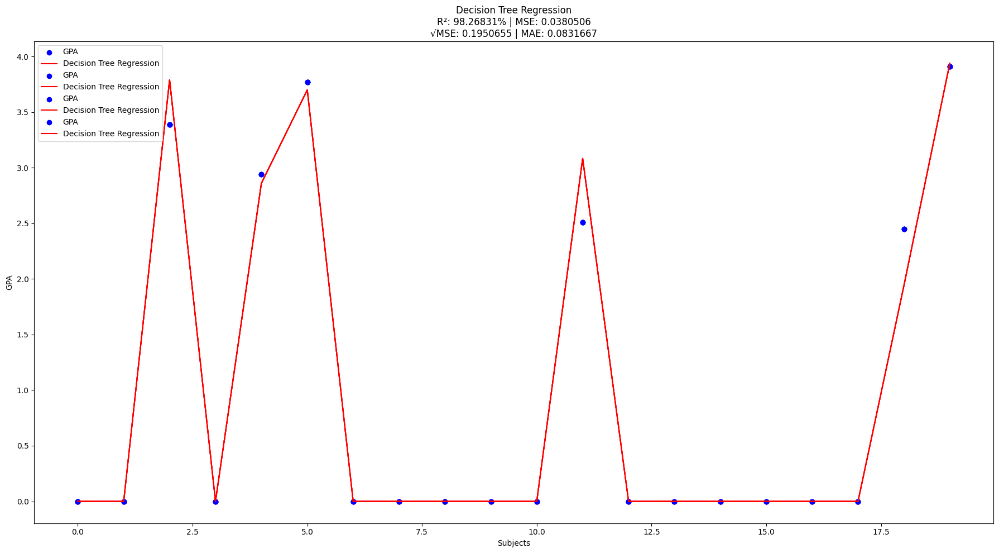

# codingSKT

# Machine Learning | Supervised Learning | Regression
- [Linear Regression](https://codingskt.vercel.app/models/linear%20regression)
- [Polynomial Regression](https://codingskt.vercel.app/models/polynomial%20regression)
- [Regularized Linear Regression (Ridge)](https://codingskt.vercel.app/models/regularized%20linear%20regression%20(ridge))
- [Decision Tree Regression](https://codingskt.vercel.app/models/decision%20tree%20regression)

# Methods for Sign In or Sign up
- Normal Credentials
- [Google Credentials](https://developers.google.com/?hl=th)
- [Github Credentials](https://developers.google.com/?hl=th)
- [Facebook Credentials](https://developers.facebook.com/?locale=th_TH)

# Input from User to API
    const inputs = [
        ["subject1", credit1, subject1_1, subject1_2, subject1_3, subject1_4, subject1_5],
        ["subject2", credit2, subject2_1, subject2_2, subject2_3, subject2_4, subject2_5],
        ["subject3", credit3, subject3_1, subject3_2, subject3_3, subject3_4, subject3_5]
    ]

# Process of Converting Input to Array in API
    <!-- Define list -->
    let credits_studied = [[], [], [], [], []];
    let credits_earned = [[], [], [], [], []];
    let gpa = [[], [], [], [], []];
    let api = [];

    <!-- Fill credit in credits_studied[] & credits_earned[] -->
    for (let i = 0; i < inputs.length; i++) {
        for (let j = 0; j < credits_studied.length; j++) {
            credits_studied[j].push(inputs[i][1]);
            credits_earned[j].push(inputs[i][1]);
        }
    }

    <!-- Fill gpa in gpa[] -->
    for (let i = 0; i < inputs.length; i++) {
        for (let j = 0; j < gpa.length; j++) {
            gpa[j].push(inputs[i][j + 2]);
        }
    }

    <!-- Transform credit to credit earned in credits_earned[] -->
    for (let i = 0; i < credits_earned.length; i++) {
        for (let j = 0, j < credits_earned[i].length; j++) {
            credits_earned[i][j] = credits_earned[i][j] * (1 if gpa[i][j] > 0 else 0);
        }
    }

    <!-- Sum credits_studied[] & credits_earned[] -->
    for (let i = 0; i < credits_studied.length; i++) {
        credits_studied[i] = credits_studied[i].reduce((a, b) => a + b, 0);
        credits_earned[i] = credits_earned[i].reduce((a, b) => a + b, 0);
    }

    <!-- Fill gpa[] & credits_studied[] & credits_earned[] in api[] -->
    for (let i = 0; i < gpa.length; i++) {
        api.push(gpa[i] + [credits_studied[i], credits_earned[i]]);
    }
            
# Data set (Features: 2D | Labels: 1D)
## Predict GPA 2
    Features = ["Thai_1", "English_basic_1", "English_add_1", ..., "credits_studied_1", credit_earned_1", "gpa_1]
    Labels = "gpa_2"
## Predict GPA 3
    Features = ["Thai_2", "English_basic_2", "English_add_2", ..., "credits_studied_2", credit_earned_2", "gpa_1", "gpa_2"]
    Labels = "gpa_3"
## Predict GPA 4
    Features = ["Thai_3", "English_basic_3", "English_add_3", ..., "credits_studied_3", credit_earned_3", "gpa_1", "gpa_2", "gpa_3"]
    Labels = "gpa_4"
## Predict GPA 5
    Features = ["Thai_4", "English_basic_4", "English_add_4", ..., "credits_studied_4", credit_earned_4", "gpa_1", "gpa_2", "gpa_3", "gpa_4"]
    Labels = "gpa_5"
## Predict GPA 6
    Features = ["Thai_5", "English_basic_5", "English_add_5", ..., "credits_studied_5", credit_earned_5", "gpa_1", "gpa_2", "gpa_3", "gpa_4", "gpa_5"]
    Labels = "gpa_6"

# Library / Function for AI
- [pandas](https://pandas.pydata.org/): Library สำหรับอ่านข้อมูลจากตาราง (.csv)
- [matplotlib](https://matplotlib.org/): Library สำหรับสร้างกราฟเพื่อดูว่ารูปแบบการทำงานของโมเดลตรงกับข้อมูลจริงไหม
- [train_test_split](https://scikit-learn.org/stable/modules/generated/sklearn.model_selection.train_test_split.html): Function ของ scikit-learn ที่แบ่งข้อมูลเป็ฯ Training set & Testing set
- [mean_squared_error (MSE)](https://scikit-learn.org/stable/modules/generated/sklearn.metrics.mean_squared_error.html): Library สำหรับแสดงความคลาดเคลื่อนของผลลัพธ์จากโมเดลและข้อมูลจริง
- [r2_score](https://scikit-learn.org/stable/modules/generated/sklearn.metrics.r2_score.html): Library สำหรับแสดงความแม่นยำของผลลัพธ์จากโมเดลและข้อมูลจริง
- [LinearRegression](https://scikit-learn.org/stable/modules/generated/sklearn.linear_model.LinearRegression.html): Function ของ scikit-learn ที่ใช้สร้างโมเดล Linear Regression
- [PolynomialFeatures](https://scikit-learn.org/stable/modules/generated/sklearn.preprocessing.PolynomialFeatures.html): Function ของ scikit-learn ที่แปลง Features ให้มีพจน์ยกกำลัง
- [make_pipeline](https://scikit-learn.org/stable/modules/generated/sklearn.pipeline.make_pipeline.html): Function ของ scikit-learn
- [Ridge](https://scikit-learn.org/stable/modules/generated/sklearn.linear_model.Ridge.html): Function ของ scikit-learn
- [DecisionTreeRegressor](https://scikit-learn.org/stable/modules/generated/sklearn.tree.DecisionTreeRegressor.html): Function ของ scikit-learn ที่ใช้สร้างโมเดล Decision Tree Regression

# Linear Regression | การถดถอยเชิงเส้น
- 
- Highlights (+): เหมาะกับการพยากรณ์เบื้องต้นข้อมูลเป็นลักษณะกราฟเส้นตรง
- Weakness (-): อาจพยากรณ์ผลคลาดเคลื่อนถ้าข้อมูลไม่เป็นลักษณะกราฟเส้นตรง

# Polynomial Regression | การถดถอยเชิงพหุคณิต
- 
- Highlights (+): เหมาะกับการพยากรณ์ที่ข้อมูลเป็นลักษณะกราฟเพิ่ม/ลด
- Weakness (-): ถ้าเลือกเลขชี้กำลัง (degree) ของ features สูงไปทำให้เรียนรู้มากเกินไป แต่ถ้าน้อยไปทำให้เรียนรู้น้อยเกินไป

# Regularized Linear Regression (Ridge) | การถดถอยเชิงเส้นแบบมีการปรับค่าลงโทษ
- 
- Highlights (+): ลดความซับซ้อนของโมเดล ทำงานได้ดีกว่า Linear Regression ถ้า features บางตัวคล้ายกัน
- Weakness (-): ถ้าข้อมูลไม่ซับซ้อนก็ไม่ต่างจาก Linear Regression

# Decision Tree Regression | การถดถอยแบบต้นไม้ตัดสินใจ
- 
- Highlights (+): จับความสัมพันธ์ซับซ้อนและไม่เชิงเส้นได้ดี
- Weakness (-): ไม่เสถียร ไม่เหมาะกับข้อมูลต่อเนื่อง

# Source
- https://pandas.pydata.org/
- https://matplotlib.org/
- https://scikit-learn.org/stable/modules/generated/sklearn.model_selection.train_test_split.html
- https://scikit-learn.org/stable/modules/generated/sklearn.metrics.mean_squared_error.html
- https://scikit-learn.org/stable/modules/generated/sklearn.metrics.r2_score.html
- https://scikit-learn.org/stable/modules/generated/sklearn.linear_model.LinearRegression.html
- https://scikit-learn.org/stable/modules/generated/sklearn.preprocessing.PolynomialFeatures.html
- https://scikit-learn.org/stable/modules/generated/sklearn.pipeline.make_pipeline.html
- https://scikit-learn.org/stable/modules/generated/sklearn.linear_model.Ridge.html
- https://scikit-learn.org/stable/modules/generated/sklearn.tree.DecisionTreeRegressor.html